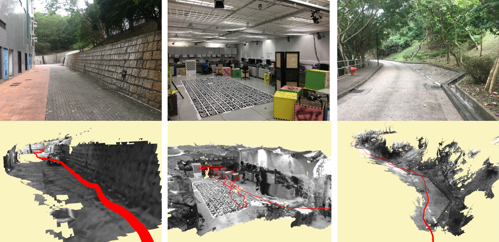
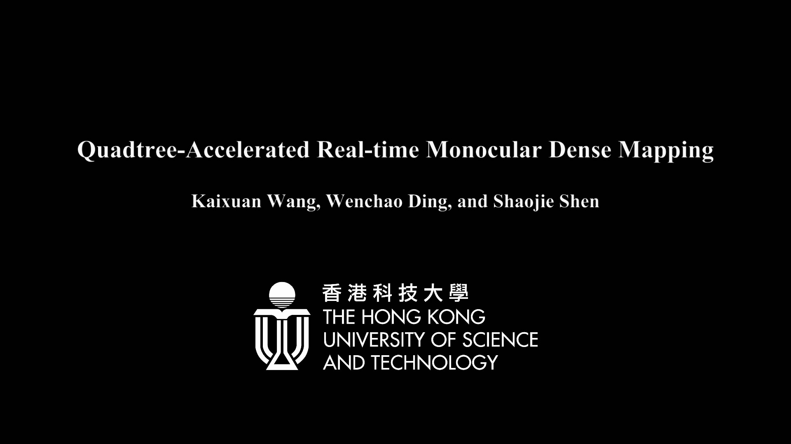

# QuadtreeMapping
## A Real-time Monocular Dense Mapping System

This is a monocular dense mapping system following the IEEE Robotics and Automation Letters (RA-L) submission **Quadtree-accelerated Real-time Monocular Dense Mapping**, Kaixuan Wang, Wenchao Ding, Shaojie Shen.

Given a localized monocular camera, the system can generate dense depth maps in real-time using portable devices. The generated depth maps can be used to reconstruct the environment or be used for UAV autonomous flight. An example of real-time reconstruction is


Red line is the camera trajectory.

A video can be used to illustrate the pipeline and the performance of our system:

<a href="https://youtu.be/3gD6_UKmRdA" target="_blank"></a>

We would like to thank [rpg_open_remode](https://github.com/uzh-rpg/rpg_open_remode) for their open source work. The project inspires us, and the system architecture helps we build QuadtreeMapping.

**Please note that, in the system, the depth value is defined as ``Euclidean distance`` instead of ``z value``. For example, if the point is (x, y, z) in camera coordinate, the depth value is**


**This branch uses opencv totally on CPU. If you need to speed up the image undistort step by using OpenCV with CUDA, please checkout to ``master`` branch.**

## 1.0 Prerequisites
+ **Ubuntu** and **ROS**

Both Ubuntu 16.04 with ROS Kinect and Ubuntu 14.04 with ROS Indigo are ok.

+ **CUDA**

The system uses GPU to parallel most of the computation. You don't need a powerful GPU to run the code, but it must be a Nvidia GPU that supports CUDA. We use CUDA 8.0 to run the system. CUDA 9.0 has not been tested yet.

+ **OpenCV**

The OpenCV that comes with ROS is ok.

## 2.0 install
Since the GPU device varies from each one to another, the CMakeLists.txt needs to be changed accordingly. 
```
cd ~/catkin_ws/src
git clone https://github.com/HKUST-Aerial-Robotics/open_quadtree_mapping.git
cd open_quadtree_mapping
```
now find the CMakeLists.txt

First, change the Compute capability in line 11 and line 12 according to your device. The default value is 61 and it works for Nvidia TITAN Xp etc. The compute capability of your device can be found at [wikipedia](https://en.wikipedia.org/wiki/CUDA).

After the change of CMakeLists.txt, you can compile the QuadtreeMapping.
```
cd ~/catkin_ws
catkin_make
```

## 3.0 parameters
Before running the system, please take a look at the parameters in the launch/example.launch.

+ ```cam_width, cam_height, cam_fx, cam_cx, cam_fy, cam_cy, cam_k1, cam_k2, cam_r1, cam_r2``` are the camera intrinsic parameters. We use pinhole model.
+ ```downsample_factor``` is used to resize the image. The estimated depth maps have size of ```cam_width*downsample_factor x cam_height*downsample_factor```. This factor is useful if you want to run QuadtreeMapping on platforms with limited resources, for example Jetson TX1.
+ ```semi2dense_ratio``` is the ratio to control output depth map frequency and must be an integer. If the input camera-pose pairs are 30Hz and you only need 10Hz depth estimation, set ```semi2dense_ratio``` to 3. High-frequency camera-pose input works better than a low-frequency input even you want a low-frequency depth estimation.

## 4.0 run QuadtreeMapping

The input of QuadtreeMapping is synchronized Image (```sensor_msgs::Image```) and Pose (```geometry_msgs::PoseStamped```). Make sure the ROS messages are the correct type and the timestamps are the same. Images and poses at different frequencies is ok. For example, the system will filter 30Hz images and 10Hz poses into 10Hz image-pose pairs as input.

### 4.1 run the example
We provide an example of a hand-held camera navigating in a garden. We provide [the link](https://www.dropbox.com/s/xuae1kxuulcf11z/open_quadtree_mapping.bag?dl=0) to download the bag. The ego-motion is estimated using [VINS-MONO](https://github.com/HKUST-Aerial-Robotics/VINS-Mono).

To run the example, just
```
roslaunch open_quadtree_mapping example.launch
```
and play the bag in another terminal
```
rosbag play example.bag
```

The results are published as:
+ /open_quadtree_mapping/depth       : estimated depth for each pixel, invalid depth are filled with zeros,
+ /open_quadtree_mapping/color_depth : color-coded depth maps for visualization, invaild depth are red,
+ /open_quadtree_mapping/debug       : color-coded depth of pixels before depth interpolation.
+ /open_quadtree_mapping/reference   : undistorted intensity image,
+ /open_quadtree_mapping/pointcloud  : point cloud from the current undistorted intensity image and the extracted depth map.

### 4.2 run with other datasets or run live
To run with other data, you can modify the launch file according to your settings. To get good results, a few things need to be noticed:
+ Good ego-motion estimation is required. The ego-motion should be precise and have the metric scale. We recommend using [VINS-MONO](https://github.com/HKUST-Aerial-Robotics/VINS-Mono) to estimate the camera motion. Visual odometry systems like ORB-SLAM cannot be directly used unless the scale information is recovered.
+ Rotation is not good for the system. Rotation reduces the number of frames QuadtreeMapping can use to estimate the depth map.
+ A good camera is required. A good choice is an industry camera that has a global shutter and is set to a fixed exposure time. Also, images should have a balanced contrast, too bright or too dark is not good.

## 4.0 fuse into a global map
Quadtree publishes depth maps and the corresponding intensity images. You can fuse them using the tool you like. We use a modified [open chisel](https://github.com/personalrobotics/OpenChisel) for 3D reconstruction and use a GPU-based TSDF to support autonomous flight.

## 5.0 future update
+ modified open chisel will be open source soon.